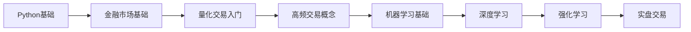

# AI-HFT 回测系统菜鸟指南 🚀

## 目录
1. [什么是高频交易？](#什么是高频交易)
2. [系统准备](#系统准备)
3. [第一步：理解基本概念](#第一步理解基本概念)
4. [第二步：准备数据](#第二步准备数据)
5. [第三步：运行第一个策略](#第三步运行第一个策略)
6. [第四步：分析结果](#第四步分析结果)
7. [第五步：开发自己的策略](#第五步开发自己的策略)
8. [常见错误及解决方案](#常见错误及解决方案)
9. [学习资源](#学习资源)

---

## 什么是高频交易？

高频交易（HFT）是一种利用强大的计算机程序在极短时间内（毫秒级）进行大量交易的策略。想象一下：
- 🏃 **速度**：比眨眼还快的交易速度
- 📊 **数据**：每秒处理数万条市场数据
- 🤖 **自动化**：完全由算法驱动，无需人工干预
- 💰 **盈利模式**：通过大量小额盈利累积收益

## 系统准备

### 1. 环境要求
```bash
# 操作系统：Linux/MacOS/Windows
# Python版本：3.8+
# 内存：至少8GB（推荐16GB+）
# 存储：至少50GB空闲空间
```

### 2. 安装依赖
```bash
# 克隆项目
git clone https://github.com/your-repo/ai-hft-backtester.git
cd ai-hft-backtester

# 创建虚拟环境（推荐）
python -m venv venv
source venv/bin/activate  # Linux/Mac
# 或
venv\Scripts\activate  # Windows

# 安装依赖
pip install -r requirements.txt
```

### 3. 验证安装
```python
# test_installation.py
import ai_hft_backtester
print("✅ 安装成功！版本：", ai_hft_backtester.__version__)
```

## 第一步：理解基本概念

### 核心概念解释 📚

#### 1. **订单簿（Order Book）**
```
卖单（Asks）↑
-----------------
价格: 50005 | 数量: 2.5
价格: 50004 | 数量: 1.2
价格: 50003 | 数量: 0.8
=================
价格: 50002 | 数量: 0.9
价格: 50001 | 数量: 1.5
价格: 50000 | 数量: 3.0
-----------------
买单（Bids）↓
```

#### 2. **做市商策略（Market Making）**
- 同时在买卖两边挂单
- 赚取买卖价差（spread）
- 承担库存风险

#### 3. **延迟（Latency）**
- 网络延迟：数据传输时间
- 处理延迟：计算和决策时间
- 每毫秒都很重要！

## 第二步：准备数据

### 方式1：使用示例数据（推荐新手）
```python
# download_sample_data.py
from ai_hft_backtester.utils import download_sample_data

# 下载BTCUSDT一天的数据作为示例
download_sample_data(
    symbol="BTCUSDT",
    date="2024-01-01",
    output_dir="./sample_data"
)
print("✅ 示例数据下载完成！")
```

### 方式2：获取真实数据
```python
# 从Binance获取历史数据
from ai_hft_backtester.data import BinanceDataCollector

collector = BinanceDataCollector()
collector.collect_orderbook_data(
    symbol="BTCUSDT",
    start_date="2024-01-01",
    end_date="2024-01-02",
    output_path="./data/binance"
)
```

### 数据格式说明
```python
# 订单簿数据格式
{
    "timestamp": 1704067200000,  # 时间戳（毫秒）
    "bids": [[50000, 1.5], [49999, 2.0], ...],  # 买单
    "asks": [[50001, 1.2], [50002, 0.8], ...],  # 卖单
}

# 成交数据格式
{
    "timestamp": 1704067200100,
    "price": 50000.5,
    "quantity": 0.1,
    "side": "buy"  # 主动方向
}
```

## 第三步：运行第一个策略

### 简单做市商策略示例
```python
# my_first_backtest.py
from ai_hft_backtester import Backtester
from ai_hft_backtester.strategies import SimpleMarketMaker

# 1. 创建回测器
print("🔧 初始化回测系统...")
backtester = Backtester(
    symbol="BTCUSDT",
    data_path="./sample_data"  # 使用示例数据
)

# 2. 配置策略
print("📋 配置交易策略...")
strategy = SimpleMarketMaker(
    spread=0.0002,      # 期望价差：0.02%
    order_size=0.01     # 每单大小：0.01 BTC
)

# 初始化策略参数
strategy.initialize(
    initial_capital=10000,  # 初始资金：$10,000
    max_position=0.1,       # 最大仓位：0.1 BTC
    inventory_target=0.0    # 目标库存：0（保持中性）
)

# 3. 运行回测
print("🚀 开始回测...")
results = backtester.run(
    strategy=strategy,
    start_date="2024-01-01 00:00:00",
    end_date="2024-01-01 01:00:00",  # 先测试1小时
    initial_capital=10000,
    commission_rate=0.0002  # 手续费：0.02%
)

# 4. 查看结果
print("\n📊 回测结果：")
results.print_statistics()

# 5. 保存结果
results.to_csv("my_first_backtest_results.csv")
print("\n✅ 结果已保存到 my_first_backtest_results.csv")
```

### 运行脚本
```bash
python my_first_backtest.py
```

### 预期输出
```
🔧 初始化回测系统...
📋 配置交易策略...
🚀 开始回测...
[■■■■■■■■■■] 100% | 处理 3600 个事件

📊 回测结果：
=====================================
策略名称: SimpleMarketMaker
回测期间: 2024-01-01 00:00 至 01:00
初始资金: $10,000.00
最终资金: $10,025.50
总收益率: 0.26%
=====================================
总交易次数: 156
盈利交易: 98 (62.82%)
平均每笔盈利: $0.52
最大回撤: 0.15%
夏普比率: 1.85
=====================================

✅ 结果已保存到 my_first_backtest_results.csv
```

## 第四步：分析结果

### 1. 理解关键指标

```python
# analyze_results.py
import pandas as pd
import matplotlib.pyplot as plt

# 读取结果
results_df = pd.read_csv("my_first_backtest_results.csv")

# 绘制权益曲线
plt.figure(figsize=(12, 6))
plt.subplot(2, 1, 1)
plt.plot(results_df['timestamp'], results_df['equity'])
plt.title('账户权益曲线')
plt.xlabel('时间')
plt.ylabel('权益 ($)')

# 绘制仓位变化
plt.subplot(2, 1, 2)
plt.plot(results_df['timestamp'], results_df['position'])
plt.title('仓位变化')
plt.xlabel('时间')
plt.ylabel('BTC数量')
plt.tight_layout()
plt.savefig('backtest_analysis.png')
print("📊 分析图表已保存")
```

### 2. 关键指标解读

| 指标 | 含义 | 好的标准 |
|------|------|----------|
| 总收益率 | 策略盈利能力 | > 0 |
| 夏普比率 | 风险调整后收益 | > 1.5 |
| 最大回撤 | 最大亏损幅度 | < 5% |
| 胜率 | 盈利交易占比 | > 55% |
| 平均持仓时间 | 资金使用效率 | 因策略而异 |

## 第五步：开发自己的策略

### 策略模板
```python
# my_custom_strategy.py
from ai_hft_backtester.strategies import BaseStrategy
from ai_hft_backtester.core.orderbook import OrderBook
from typing import List, Dict

class MyCustomStrategy(BaseStrategy):
    """我的第一个自定义策略"""
    
    def __init__(self):
        super().__init__("MyCustomStrategy")
        self.last_trade_time = 0
        self.min_trade_interval = 1000  # 最小交易间隔（毫秒）
        
    def on_initialize(self, **kwargs):
        """初始化策略参数"""
        self.threshold = kwargs.get('threshold', 0.0001)
        self.trade_size = kwargs.get('trade_size', 0.01)
        
    def on_orderbook_update(self, orderbook: OrderBook, timestamp: int) -> List[Dict]:
        """处理订单簿更新"""
        actions = []
        
        # 获取最佳买卖价
        best_bid, best_ask = orderbook.get_best_bid_ask()
        if not best_bid or not best_ask:
            return actions
            
        # 计算价差
        spread = (best_ask - best_bid) / best_bid
        
        # 简单的交易逻辑
        if spread > self.threshold and timestamp - self.last_trade_time > self.min_trade_interval:
            # 价差足够大，尝试套利
            actions.append({
                'action': 'place_order',
                'side': 'buy',
                'price': best_bid + 0.01,
                'quantity': self.trade_size,
                'order_type': 'limit'
            })
            
            actions.append({
                'action': 'place_order',
                'side': 'sell',
                'price': best_ask - 0.01,
                'quantity': self.trade_size,
                'order_type': 'limit'
            })
            
            self.last_trade_time = timestamp
            
        return actions
        
    def on_trade(self, trade: Dict, timestamp: int):
        """处理成交"""
        print(f"成交！价格: {trade['price']}, 数量: {trade['quantity']}")
```

### 测试自定义策略
```python
# test_custom_strategy.py
from ai_hft_backtester import Backtester
from my_custom_strategy import MyCustomStrategy

# 创建并运行
strategy = MyCustomStrategy()
strategy.initialize(
    initial_capital=10000,
    threshold=0.0002,
    trade_size=0.01
)

backtester = Backtester(data_path="./sample_data")
results = backtester.run(
    strategy=strategy,
    start_date="2024-01-01",
    end_date="2024-01-02",
    initial_capital=10000
)

results.print_statistics()
```

## 常见错误及解决方案

### 1. 数据相关错误

**错误**：`DataLoader.load_data() is not implemented`
```python
# 解决方案：实现自己的数据加载器
from ai_hft_backtester.data import DataLoader
import pandas as pd

class MyDataLoader(DataLoader):
    def load_data(self, symbol, start_date, end_date):
        # 从CSV文件加载数据
        orderbook_df = pd.read_csv(f"data/{symbol}_orderbook.csv")
        trades_df = pd.read_csv(f"data/{symbol}_trades.csv")
        return orderbook_df, trades_df
```

### 2. 内存错误

**错误**：`MemoryError` 或系统变慢
```python
# 解决方案：分批处理数据
backtester = Backtester(
    data_path="./data",
    chunk_size=10000  # 每次处理10000条数据
)
```

### 3. 策略错误

**错误**：策略不下单
```python
# 调试技巧：添加日志
def on_orderbook_update(self, orderbook, timestamp):
    print(f"[DEBUG] 时间: {timestamp}, 买一: {orderbook.get_best_bid_ask()[0]}")
    # ... 策略逻辑
```

## 学习资源

### 📚 推荐阅读
1. **基础知识**
   - 《量化交易入门》
   - 《Python金融分析》
   - [Binance API文档](https://binance-docs.github.io/apidocs/)

2. **高频交易**
   - 《高频交易》(Michael Lewis)
   - 《算法交易:制胜策略与原理》
   - [Jane Street技术博客](https://blog.janestreet.com/)

3. **机器学习**
   - 《深度学习》(Ian Goodfellow)
   - [fast.ai课程](https://www.fast.ai/)
   - PyTorch官方教程

### 🎓 学习路径


### 💡 实践建议
1. **从简单开始**：先理解基础策略，再尝试复杂模型
2. **注重风险**：永远不要忽视风险管理
3. **持续学习**：市场在变化，策略需要不断进化
4. **模拟优先**：充分测试后再考虑实盘
5. **记录一切**：保持交易日志，分析成功和失败

---

## 下一步

恭喜你完成了入门指南！🎉 接下来你可以：

1. **深入学习**：阅读[详细技术文档](USER_GUIDE.md)
2. **尝试AI策略**：学习如何集成机器学习模型
3. **优化性能**：了解如何使用Numba加速
4. **加入社区**：与其他量化交易者交流经验

记住：成功的量化交易需要持续学习和实践。祝你交易顺利！💰

---

*最后更新：2024年1月*